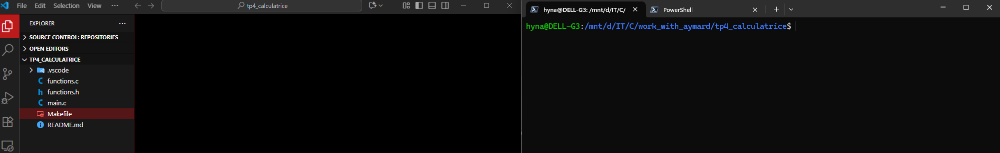
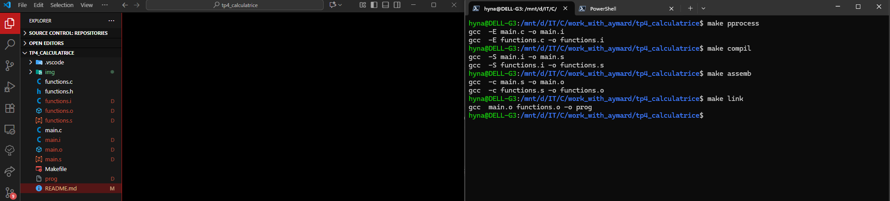

# TP4 — Compilation **manuelle** (Calculatrice)

## But

Compiler et exécuter la calculatrice **sans Makefile**, en déroulant **toutes les étapes** de la toolchain GCC.

## Pré-requis

- `gcc` installé (toute version récente)
- Arborescence :

```
.
├─ main.c
├─ functions.h
├─ functions.c
└─ README.md
```

## Vue d’ensemble

Pipeline standard : **Préprocessing (`.i`) → Compilation (`.s`) → Assemblage (`.o`) → Link (exécutable)**.

---

## Étape 1 — Préprocessing → `*.i`

**Commande** (par fichier) :

```bash
gcc -std=c2x -pedantic -Wall -Wextra -Werror -E main.c       -o main.i
gcc -std=c2x -pedantic -Wall -Wextra -Werror -E functions.c  -o functions.i
```

**Rôle** :

- Remplace `#include` par le contenu réel des en-têtes.
- Développe les macros `#define`.
- Supprime les commentaires.
  **Résultat** : fichiers C **préprocessés** `main.i`, `functions.i`.

---

## Étape 2 — Compilation → `*.s`

**Commande** :

```bash
gcc -std=c2x -pedantic -Wall -Wextra -Werror -S main.i       -o main.s
gcc -std=c2x -pedantic -Wall -Wextra -Werror -S functions.i  -o functions.s
```

**Rôle** :

- Transforme le C préprocessé en **assembleur** de la cible.
  **Résultat** : fichiers assembleur `main.s`, `functions.s`.

---

## Étape 3 — Assemblage → `*.o`

**Commande** :

```bash
gcc -std=c2x -pedantic -Wall -Wextra -Werror -c main.s       -o main.o
gcc -std=c2x -pedantic -Wall -Wextra -Werror -c functions.s  -o functions.o
```

**Rôle** :

- Convertit l’assembleur en **objets** binaires.
  **Résultat** : fichiers objets `main.o`, `functions.o` (code machine non lié).

---

## Étape 4 — Édition des liens → exécutable

**Commande** :

```bash
gcc -std=c2x -pedantic -Wall -Wextra -Werror main.o functions.o -o prog
```

**Rôle** :

- **Résout les symboles** entre objets (`add`, `sub`, `mul`, `diviz`).
- Produit l’**exécutable** final.
  **Résultat** : binaire `./prog`.

---

## Exécution

```bash
./prog
```

---

## Variante A — Chaîne courte (sans fichiers intermédiaires)

**Commande unique** :

```bash
gcc -std=c2x -pedantic -Wall -Wextra -Werror main.c functions.c -o prog
```

**Rôle** :

- Laisse GCC exécuter toutes les étapes en interne et ne conserve que l’exécutable.

---

## Variante B — Compilation en 2 temps (`.c` → `.o` → link)

**Commandes** :

```bash
gcc -std=c2x -pedantic -Wall -Wextra -Werror -c main.c      -o main.o
gcc -std=c2x -pedantic -Wall -Wextra -Werror -c functions.c  -o functions.o
gcc -std=c2x -pedantic -Wall -Wextra -Werror main.o functions.o -o prog
```

**Rôle** :

- Compile chaque unité de traduction en objet, puis lie.
- Recompile uniquement les fichiers modifiés.

---

## Mode debug (optionnel)

**Commandes** :

```bash
gcc -std=c2x -O0 -g -Wall -Wextra -pedantic -fsanitize=address,undefined -c main.c      -o main.o
gcc -std=c2x -O0 -g -Wall -Wextra -pedantic -fsanitize=address,undefined -c functions.c  -o functions.o
gcc -std=c2x -O0 -g -Wall -Wextra -pedantic -fsanitize=address,undefined main.o functions.o -o prog
```

**Rôle** :

- Ajoute symboles de debug, désactive les optimisations, active les sanitizers pour détecter UB/fuites.

---

## Explication des options GCC

- `-std=c2x` : compile selon le standard C2x (C23) pour assurerer un accès aux dernières fonctionnalités du langage.
- `-pedantic` : signale tout ce qui n’est pas strictement conforme au standard choisi
- `-Wall` : active un ensemble de diagnostics considérés essentiels
- `-Wextra` : ajoute des avertissements supplémentaires
- `-Werror` : transforme **tous** les avertissements en **erreurs** de compilation pour empêcher l’émission d’un binaire si des problèmes sont détectés.

- `-E` : s’arrête après préprocessing → `.i`
- `-S` : s’arrête après compilation → `.s`
- `-c` : s’arrête après assemblage → `.o`
- `-o <file>` : nom de sortie

## Tests

### Before



### After


